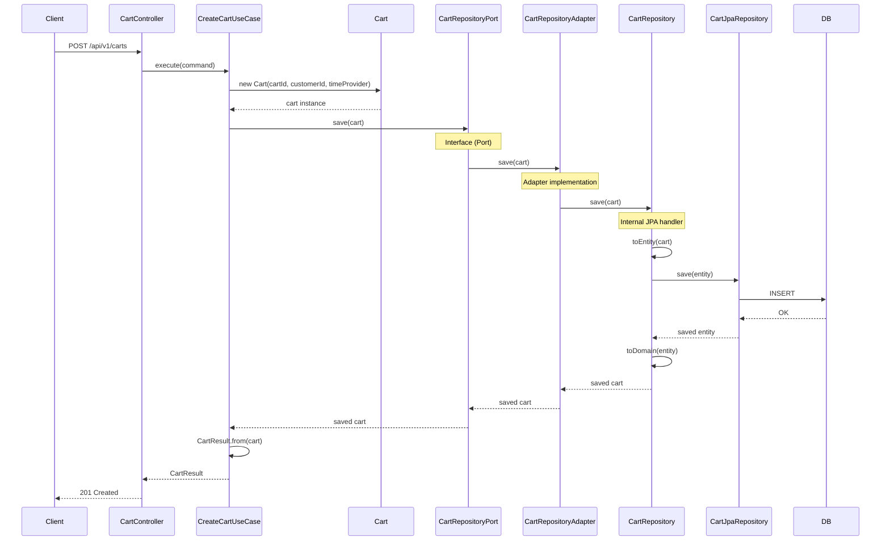
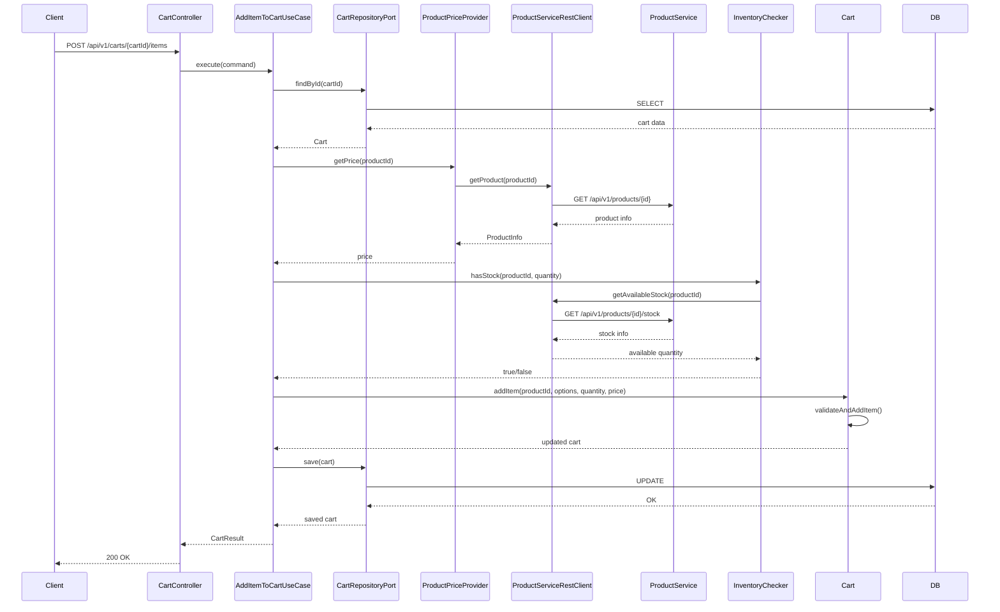
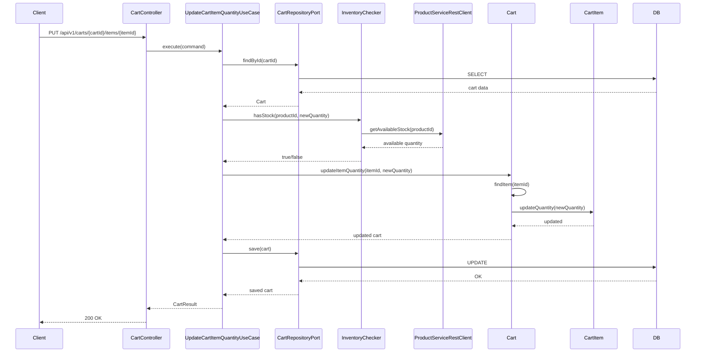
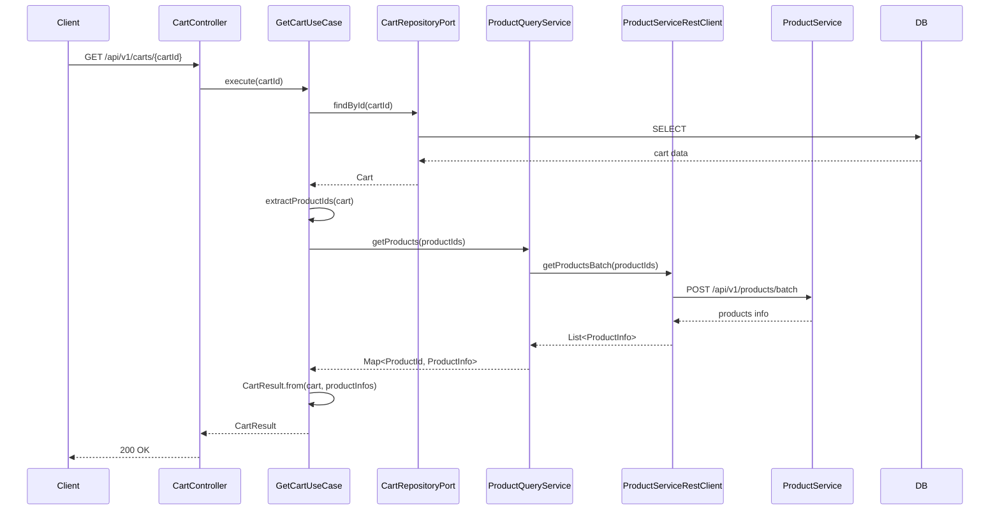
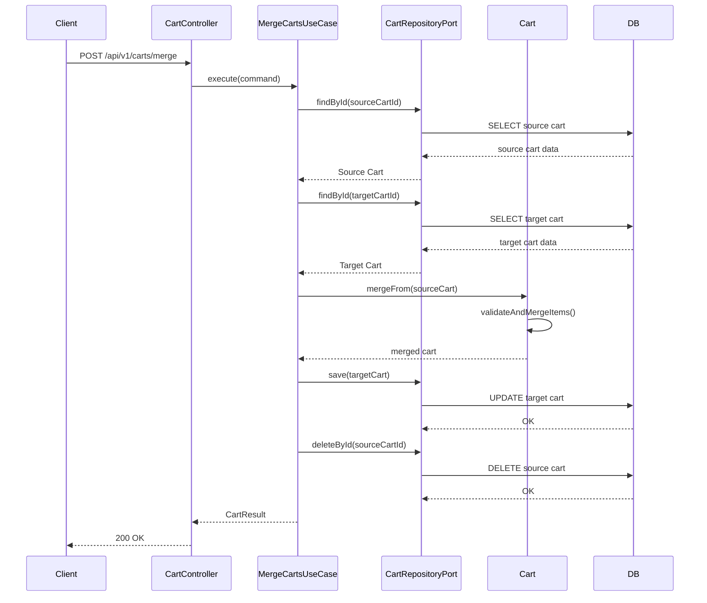
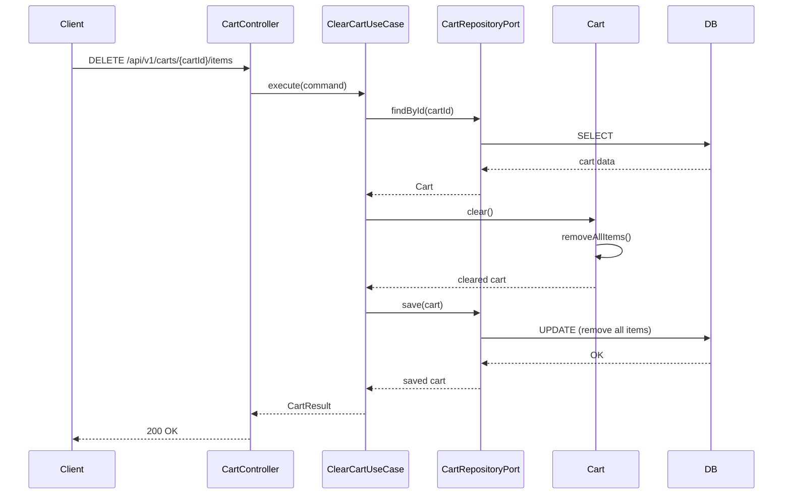

# 시퀀스 다이어그램

## 1. 장바구니 생성 (CreateCartUseCase)

## 2. 장바구니에 상품 추가 (AddItemToCartUseCase)

## 3. 장바구니 상품 수량 변경 (UpdateCartItemQuantityUseCase)

## 4. 장바구니 조회 (GetCartUseCase)

## 5. 장바구니 상품 제거 (RemoveItemFromCartUseCase)

## 6. 장바구니 병합 (MergeCartsUseCase)

## 7. 장바구니 비우기 (ClearCartUseCase)

